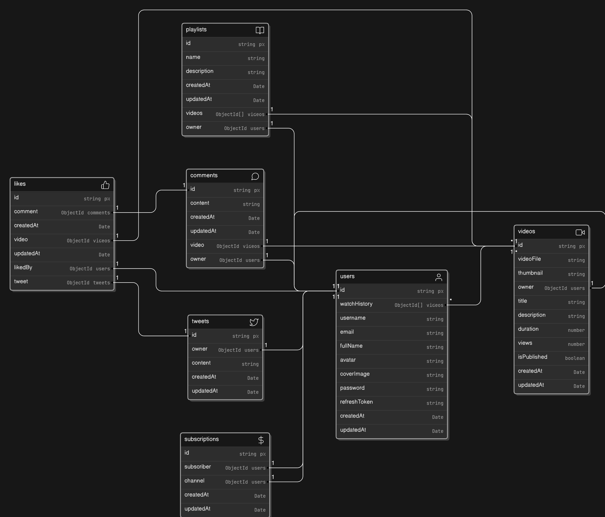

# Video Hosting Backend Project

This repository contains the backend code for a complete video hosting website similar to YouTube. The project is built using Node.js, Express.js, MongoDB, Mongoose, JWT, bcrypt, and other technologies.

## Features

- User authentication (login/signup)
- Video upload
- Like/dislike videos
- Commenting and replying to comments
- Subscription and unsubscription functionality
- ......still in progress

## Testing with Postman

To test the API endpoints using Postman, follow these steps:

Once, this project will be completed then Postman follow up steps will be uploaded

